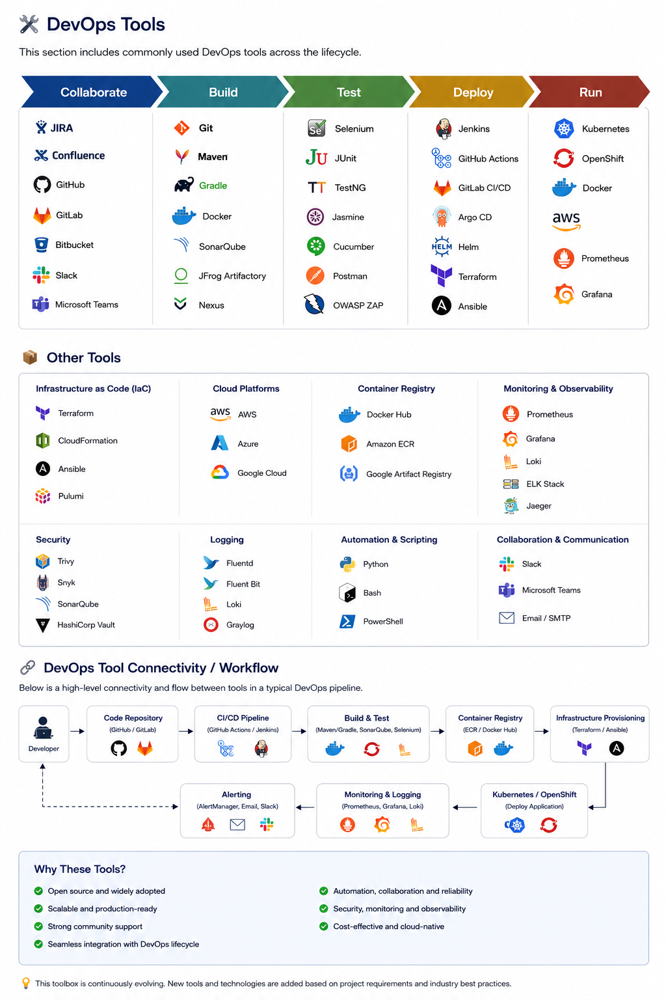

# 🚀 DevOps Projects Portfolio

Welcome to my DevOps Projects Repository. This repository contains production-ready DevOps projects focused on CI/CD automation, Kubernetes orchestration, Infrastructure as Code (IaC), Cloud Native deployments, and Monitoring solutions.

---

## 👨‍💻 About Me

Passionate DevOps Engineer with hands-on experience in:

* CI/CD Automation
* Kubernetes Administration
* AWS Cloud Infrastructure
* Infrastructure as Code (Terraform)
* Containerization (Docker)
* Monitoring & Observability
* GitOps and DevSecOps Practices

---

# 📊 Complete Projects Overview

| #  | Project Title                       | Tools & Technologies                                            | Description                                                                          |
| -- | ----------------------------------- | --------------------------------------------------------------- | ------------------------------------------------------------------------------------ |
| 01 | Automated CI/CD Pipeline on AWS EKS | GitHub Actions, Docker, Terraform, AWS EKS, Prometheus, Grafana | End-to-end production-grade CI/CD pipeline with Kubernetes deployment and monitoring |
| 02 | Automated CI/CD via GitHub Actions  | Terraform, AWS EKS, AWS ECR, VPC, S3, IAM                       | Infrastructure provisioning and automated Kubernetes deployments on AWS              |
| 03 | Java CI/CD with Jenkins & OpenShift | Jenkins, OpenShift, Maven, Docker, Git                          | Enterprise Java application CI/CD pipeline with automated deployment                 |

---

# ☸️ Kubernetes Tools & Usage

| Tool             | Purpose                                         |
| ---------------- | ----------------------------------------------- |
| Kubernetes (K8s) | Container orchestration platform                |
| kubectl          | Kubernetes command-line management              |
| EKS              | Managed Kubernetes on AWS                       |
| OpenShift        | Enterprise Kubernetes platform                  |
| Helm             | Kubernetes package manager                      |
| Kustomize        | Kubernetes configuration customization          |
| Metrics Server   | Resource utilization monitoring                 |
| Prometheus       | Metrics collection and monitoring               |
| Grafana          | Dashboard and visualization                     |
| ArgoCD           | GitOps continuous delivery                      |
| Ingress NGINX    | Traffic routing and load balancing              |
| Cert Manager     | SSL/TLS certificate automation                  |
| External DNS     | DNS automation for Kubernetes services          |
| Velero           | Backup and disaster recovery                    |
| Fluent Bit       | Log collection and forwarding                   |
| EFK Stack        | Elasticsearch, Fluentd, Kibana logging solution |

---

# 🛠️ DevOps Tech Stack

### Cloud Platforms

* AWS
* Azure (Learning)
* OpenShift

### Infrastructure as Code

* Terraform
* CloudFormation (Basic)

### Containers & Orchestration

* Docker
* Kubernetes
* EKS
* OpenShift
* Helm

### CI/CD Tools

* GitHub Actions
* Jenkins
* GitLab CI/CD

### Monitoring & Observability

* Prometheus
* Grafana
* AlertManager

### Version Control

* Git
* GitHub

### Scripting

* Bash
* Python


```

<h2 align="center">🛠 DevOps Tools Ecosystem</h2>

<p align="center">
  
</p>
```


```

# 📈 Key DevOps Skills Demonstrated

✅ Infrastructure as Code (Terraform)

✅ Kubernetes Cluster Management

✅ AWS Cloud Services

✅ Docker Containerization

✅ GitHub Actions Automation

✅ Jenkins Pipelines

✅ OpenShift Administration

✅ Monitoring & Alerting

✅ GitOps Concepts

✅ Production Deployment Strategies

✅ Blue-Green Deployments

✅ Rolling Updates

✅ Kubernetes Troubleshooting

---

# 🎯 Future Projects

* ArgoCD GitOps Implementation
* EKS Multi-Environment Setup
* Kubernetes Security Scanning
* DevSecOps Pipeline
* Istio Service Mesh
* Kubernetes Cost Optimization
* Multi-Cluster Kubernetes Management

---

## ⭐ Support

If you find these projects useful, feel free to star the repository and connect with me.

Happy Learning & Automating! 🚀
